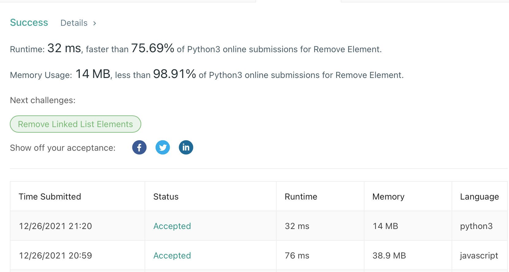

## 
Remove Element

#### 
📚 _LeetCode Problem #27 (**Level Easy**) 12/26/2021_ 

**_
By Daniel Adeyemi_**

---

## 
 🚩 _Description_:

##### **_This is solutions for Leet Code problem [# 27 "Remove Element"](https://leetcode.com/problems/remove-element/)._**

### 
 🤔 Problem description:

Given an integer array nums and an integer val, remove all occurrences of val in nums in-place. The relative order of the elements may be changed.

Since it is impossible to change the length of the array in some languages, you must instead have the result be placed in the first part of the array nums. More formally, if there are k elements after removing the duplicates, then the first k elements of nums should hold the final result. It does not matter what you leave beyond the first k elements.

Return k after placing the final result in the first k slots of nums.

Do not allocate extra space for another array. You must do this by modifying the input array in-place with O(1) extra memory.

## 
 🚥 Tests

## 
 🛠️ _Technologies used:_

- Python 3.9
- JavaScript

## 
 🌟 _Teaching points:_

- if we need to remove few elements in array and keep going - make index variable and assign elements we don't need to remove to this index, then increment index
- in JS we can increment index when we are assigning value `element[index++] = someValue` will assign **element[index]** value **someValue** and then **increment index by 1**

## 
 📬 Contact Information

#### For any questions _[email author](mailto:adeyemidany+github@gmail.com?subject=[GitHub])_

## 
 📘 _License and copyright:_

> **_© Daniel Adeyemi, 2021_**  
> ⚖️ __
